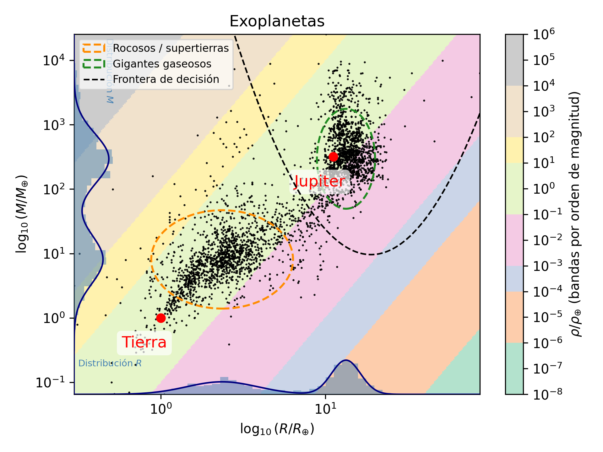

# Proyecto 1er mes: Transisión planetaria
**Autor:** Luis Daniel Díaz Durango

## Indice
- [Indice](#indice)
- [Contexto](#contexto)
- [Declaración de uso de IA](#declaración-de-uso-de-ia)

## Contexto 

Este repo contiene la solución al primer proyecto de la materia: Minería de datos en Astronomía. Para más información ver [asignación del proyecto.](https://esilvavilla.github.io/MineriaDatosweb/Proyecto%201er%20mes.html)

## Planteamiento del problema
Transición Planetaria: Graficar Masa vs Radio. Identificar dónde los planetas dejan de ser rocosos densos y pasan a ser gigantes gaseosos esponjosos.

## Solución
### Proceso de construcción
Cargando del archivo `datos_mision.db`, procedemos a construir una gráfica de exploración. Se obervó una aglumeración de los datos, por lo que no se puede observar una tendencia clara. Dado que los datos parecen tener un gran rango de valores, se procedió a aplicar un logaritmo a ambos ejes (masa y radio) para obtener una mejor visualización.

Accediendo a la [documentación de la API de Exoplanet Archive](https://exoplanetarchive.ipac.caltech.edu/docs/API_PS_columns.html), se puede observar que las unidades de masa y radio son en masas terrestres (M_Earth) y radios terrestres (R_Earth). En consecuencia, decidimos determinar la desidad $\rho = \frac{M}{4/3\pi R^3}$ en términos de densidades terrestres $\rho_{\oplus}$.

Para la guía establecimos dos puntos que muestran la densidad de la Tierra y de Júpiter. Y además, generamos un mapa de colores que nos indica las isodensidades a las que se encuentran los diferentes planetas en nuestro diagrama. 

Se observó una aglimeración de dos subgrupos en nuestro diagrama, y por ende se procedió a encerrarlos asumiendo una distribución bimodal de gaussianas en ambos ejes.

### Discusión de resultados

La anterior grafica nos muestra los resultados obtenidos tras el [proceso de construcción](#proceso-de-construcción). Hay que discutir algunos de los resultados obtenidos.

#### Isodensidades en el diagrama log-log
Sabemos que la densidad está dada por:

$$\rho = \frac{M}{4/3\pi R^3}$$

Por ende, asumamos que tenemos un conjunto de $\rho_0$ constantes, y queremos ver la forma en la que se verá en nuestro diagrama log-log.

$$
\begin{align*}
\log_{10}(\rho_0) &= \log_{10}(M) - 3\log_{10}(R) -  \log_{10}(4/3 \pi)  \\
\Rightarrow \log_{10}(M) &= 3\log_{10}(R) +  c  \\
\end{align*}
$$
Por lo que esperamos que en el diagrama log-log, las isodensidades sean rectas. Más aún, como c depende de $\rho_0$, esperamos que las rectas sean paralelas entre sí. Y este es justamente el resultado obtenido.

#### Agrupación de datos y ajuste bimodal
Hacer el análisis desde dicha perspectiva, es lógico, a continuación argumentaremos el enfoque y estableceremos las limitantes de hacer un ajuste bimodal.

A la hora de hacer una análisis de datos, se busca encontrar patrones, por lo que, en general, teórias físicas no deben ser impuestas a mano, sino que surgen de manera natural de los datos. En este caso, se observa una agrupación de dos grandes grupos en nuestro diagrama. Considerar una única variable, como la densidad de un planeta para la clasificación, puede resultar demasiado simplista, puesto que, cómo vemos en el diagrama, Jupiter (un gigante gaseoso) y la Tierra (una supertierra rocosa) se encuentran en el mismo orden de magnitud de densidad, pero en diferentes regiones del diagrama, Así que, esta variable (que podría ser decisisoria bajo un marco teórico más amplio), tabajando netamente con los datos, sin conocimiento profundo de la teoría, no es la mejor opción, puesto que elimina información relevante. Por ende, se optó por tomar la clasificación con ayuda de los propios datos, esto es, masa y radio.

Supongamos que pertenercer a un grupo o al otro, depende de la distribución de probabilidad de que un planeta tenga una masa y un radio particulares (dejando de lado el efecto de la densidad). De este modo, lo único que tendremos que hacer es determinar la distribución de probabilidad en este espacio de masa y radio que nos permita clasificar a los planetas en dos grupos. Por tanto, el objetico es encontrar dicha distribución de probabilidad.

En dos dimensiones, las distribuciones de probabilidad pueden tener formas arbitrarias en principio (aunque se pueden acotar de forma teórica, sólo que no es el objetivo de este proyecto). Para fines prácticos, se decidió, en lugar de determinar la distribución de probabilidad, asumir que los fenomenos que determinan el radio y la masa son independientes (lo cual es falso físicamente, pero es la primera aproximación que se puede hacer), por lo cual, distribución de probabilidad conjunta se puede factorizar como el producto de las distribuciones de probabilidad marginales.

Ahora, bajo dicha suposición, se puede plantear un modelo que ajuste las dos distribuciones marginales. Segun los histogramas marginales, se puede observar que las distribuciones tienen una tendencia bimodal, por lo que se asume que la distribución de probabilidad conjunta es la suma de dos gaussianas. Así, con una confianza del 95% (2 $\sigma$), se puede trazar una elipse que encierre el 95% de la distribución de probabilidad conjunta, y bajo las condiciones dadas, se puede asumir que todos los planetas cuyos puntos se encuentren dentro de dicha elipse, pertenecen al mismo grupo.

Los grupos establecidos son, los que en la gráfica corresponden a las regiones de color verde (gigantes gaseosos) y naranja (rocosos/supertierras).

Nuevamente se recalca que dicho enfoque tiene muchos errores, pero ayuda a obtener una mejor clasificación que considerando unicamente la densidad sin un marco teórico más amplio.

#### Estrategia de clasificación
En este sentido, podemos definir un criterio más amplio para la clasificación de tipos de planetas de la siguiente manera: 
Sea:
- $A$: Conjunto de planetas rocosos/supertierras
- $B$: Conjunto de planetas gigantes gaseosos
- $C$: Conjunto de planetas que no pertenecen a A ni a B

y $P$ la probabilidad.

1. Hallamos $P(A | M, R)$ y $P(B | M, R)$
2. Hallamos $P(C | M, R)$
3. Comparamos las probabilidades. Si las probabilidades de 2 son parecidas a las de 1, entonces no se puede determinar a que grupo pertenece el planeta, de lo conrario, se establece el grupo con la mayor probabilidad.

El resultado de esto (sin tomar en cuenta 2, o sea, asumiendo que $ A \cap B = \emptyset $), da como resultado lal "frontera de decisión" que se observa en la gráfica.

Este resultado se puede mejorar tomando en cuenta que el aporte de la masa y el radio no tiene por qué tener la misma importancia, esto es, los gases pesan menos que las rocas en general, porque no tienen consentraciones tan altas (en el promedio de planetas), por lo que está variable puede ser más decisiva que el radio. Así, con otro conjunto de hipotesis físicas, se puede determinar una mejor frontera de decisión.

## Declaración de uso de IA.
Los siguientes archivos no fueron generados por IA, fueron hechos de forma manual con lo aprendido hasta el momento con la materia.

- constructor_db.py
- README.md
- requirements.txt

El uso de la IA (Cursor/ claude code / claude), fue realizado específicamente en `analisis_visual.py`. Fue usado para crear las gráficas a parte de lo que se aprendió en clase. En este sentido, se contruyó la base (grafico masa vs radio cargando los datos de forma manual), y toda la contrucción adicional fue realizada con ayuda de la IA. **TODAS LAS IDEAS SON MIAS, NO LA DE LA IA.**, el papel de la IA es llevar a cabo las ideas propias.